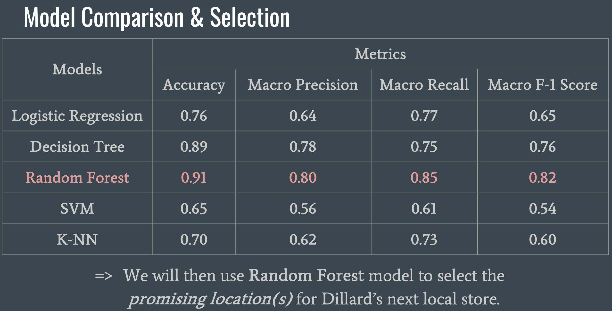
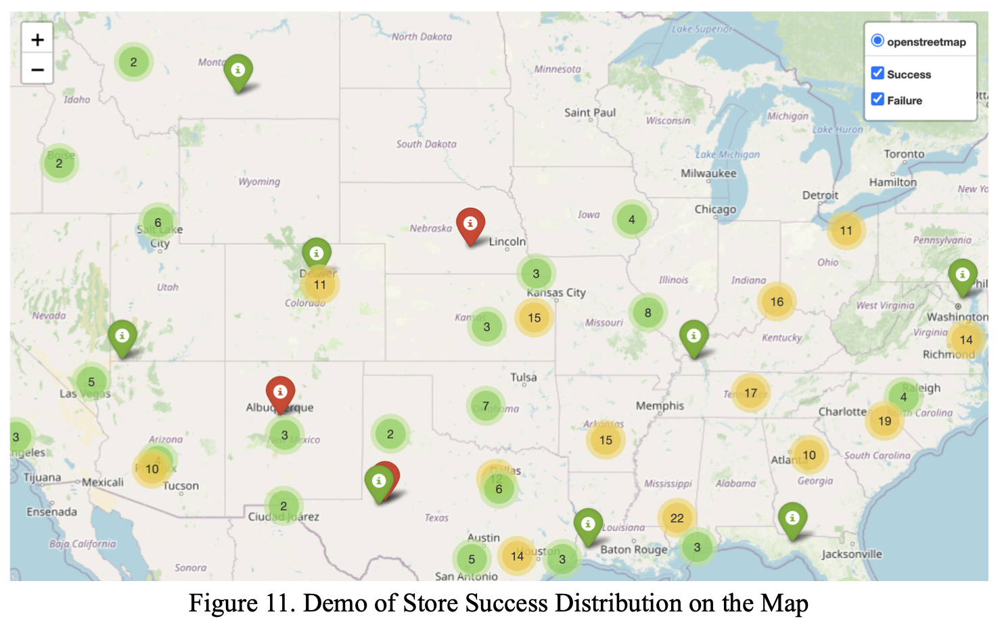

# Optimization of Locations for Dillard’s Store Expansion

This is a Big Data project which optimized store locations using machine learning models on demographic data, achieving high accuracy in predicting successful placements.

## Table of Contents
- [Project Description](#project-description)
- [Dataset Overview](#dataset-overview)
- [Implemented Models and Results](#implemented-models-and-results)
- [Contributors](#contributors)

## Project Description
This project aims to identify promising locations for Dillard’s next store by leveraging sales data and consulting-backed estimations. Dillard’s, an American department store chain founded in 1938, operated over 300 locations as of 2005. The company’s online store at Dillards.com complements its physical retail spaces, offering a comprehensive shopping experience.

The motivation behind this project stems from the critical importance of selecting optimal store locations. Poor location choices can directly impact a store’s long-term success, leading to operational inefficiencies and negatively affecting overall profitability. The primary objective of this project is to minimize the risks associated with opening new stores by using data-driven insights to ensure that investments are strategically directed for optimal returns.

## Dataset Overview
Dillard’s is a major retail chain with several stores. Their point-of-sales (POS) data over a period of time is available in Postgres SQL (over 1GB). There are 5 tables on schema. 

## Data Science Pipeline

1. Data Cleansing and Preparation
2. Exploratory Data Analysis (EDA)
3. Feature Selection and Engineering
    - Key performance indicators (KPIs) such as **Average Cost of Goods Sold (COGS) per Item Sold**, **Month-over-Month Growth**, and **Return Percentage**
4. Model Development and Evaluation
    - Models include: Logistic Regression, Decision Tree, Random Forest, SVM, and k-NN
5. Visualization and Reporting
6. Recommendation - Decision Region
7. Extra: ROI Analysis

See more details in the [report](Dillards_Final_Report.pdf) and [slides](Dillards_Presentation.pdf).

## Deliverables

- [Deck for a 15-minute presentation](Dillards_Presentation.pdf)
- [Final report](Dillards_Final_Report.pdf)
- [ROI analysis](Dillards_ROI.xlsx)
- [Codes](Codes/): 
    - `FinalData.ipynb`
    - `FinalFeatureEngineering.ipynb`
    - `FinalModel.ipynb`
    - `requirements.txt`

## Contributors
- Xiyi Lin
- Omar Shatrat 
- Fanqi Song
- Tianyu Wu

